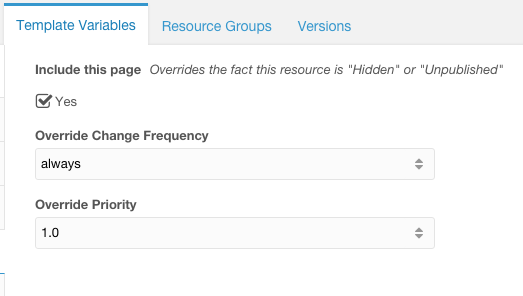

# MODX-GoogleSitemap0.9
XML Sitemap Extra with Template Variables to override dynamic processing



##After Installation

1. Set the Templates you want to include by editing the Template "Google Sitemap 0.9"  
```
[[!GoogleSitemap0.9? &templates=`1,2,3`]]
```

2. update the Template => TV Access for the override options


## Roadmap 1.0

1. Template Variable to Override "Published" and "Hidden" Resource settings
2. Template Variable to Override "changefreq"
3. Template Variable to Override "priority"
4. Start Listing by Template

## Roadmap 1.1

1. Image Node in XML
2. News Node in XML

## Roadmap 2.0
2. Video Node in XML
